# 🛡️ SOC Alert Monitoring & Log Correlation Capstone

**A hands-on SOC investigation simulation — endpoint, network, and authentication log correlation with automated analysis and reporting.**


---

## 📌 Project Overview

This project simulates a **SOC (Security Operations Center) investigation workflow** in a controlled, isolated virtual lab. A Windows 11 endpoint was monitored using Sysmon and Windows Event Logs, while network traffic was captured and inspected with Wireshark. A separate Kali Linux machine was used to run controlled reconnaissance activity (Nmap) against the monitored endpoint.

All collected logs were processed using a custom-built **Python SOC Incident Analyzer**, which correlates activity across endpoint, network, and authentication log sources, extracts Indicators of Compromise (IOCs), maps observed behavior to the **MITRE ATT&CK** framework, and produces a risk-scored incident summary.

The goal of this project is to demonstrate a realistic, analyst-style approach to **log collection, correlation, and triage** — the core skill set of a Tier 1/2 SOC analyst — using open-source tooling and a fully self-contained lab environment.

A single log rarely tells the full story. The value in this project comes from connecting events across sources — for example, tying a process starting on the endpoint to a network connection that follows seconds later. That connection is what turns raw logs into an actual investigation.

---

## 🧭 Architecture / Workflow

```
┌─────────────────────┐         ┌──────────────────────┐
│   Kali Linux (VM)    │  Nmap   │   Windows 11 (VM)     │
│   Simulated Source   │───────▶│   Monitored Endpoint  │
│                       │  Scan   │                        │
└─────────────────────┘         └───────────┬───────────┘
                                             │
                     ┌───────────────────────┼───────────────────────┐
                     ▼                       ▼                       ▼
              ┌─────────────┐        ┌──────────────┐        ┌──────────────┐
              │   Sysmon    │        │ Windows Event│        │  Wireshark   │
              │ (Proc/Net)  │        │ Log (4624/25)│        │ (Packet Cap) │
              └──────┬──────┘        └──────┬───────┘        └──────┬───────┘
                     │                      │                       │
                     └──────────────┬───────┴───────────────────────┘
                                     ▼
                       ┌─────────────────────────────┐
                       │  Python SOC Incident Analyzer│
                       │  • Log Correlation            │
                       │  • Timeline Reconstruction     │
                       │  • IOC Extraction               │
                       │  • MITRE ATT&CK Mapping          │
                       │  • Risk Scoring                   │
                       └───────────────┬───────────────┘
                                       ▼
                         ┌───────────────────────────┐
                         │   SOC Incident Report      │
                         │   (Findings + Risk Score)  │
                         └───────────────────────────┘
```

---

## ✨ Features

- 🔍 Endpoint telemetry collection via Sysmon (process creation, network connections)
- 🪵 Windows Event Log analysis for authentication activity (Event ID 4624, 4625)
- 📡 Network traffic capture and inspection using Wireshark
- 🎯 Controlled reconnaissance simulation using Kali Linux and Nmap
- 🔗 Cross-source log correlation — endpoint, network, and authentication data combined into a single timeline to see how one event leads to the next
- 🧬 Automated extraction of Indicators of Compromise (IOCs) from correlated logs
- 🗺️ MITRE ATT&CK technique mapping for observed activity
- 📊 Weighted risk scoring based on detected findings
- 📄 Automated incident report generation
- 🧪 Fully isolated virtual lab with no external network exposure

---

## 🧰 Tools & Technologies

| Category | Tool | Purpose |
|---|---|---|
| Virtualization | VMware Workstation Pro | Isolated lab environment |
| Target OS | Windows 11 | Monitored endpoint |
| Source OS | Kali Linux | Controlled reconnaissance simulation |
| Endpoint Monitoring | Sysmon | Process and network telemetry |
| Log Source | Windows Event Viewer | Authentication event logging |
| Network Analysis | Wireshark | Packet capture and traffic inspection |
| Reconnaissance | Nmap | Port scanning / service discovery |
| Automation | Python 3 | Custom SOC Incident Analyzer |
| Detection Framework | MITRE ATT&CK | Technique mapping and classification |

---

## 📈 Project Results

| Metric | Result |
|---|---|
| **Incidents Detected** | 9 |
| **IOCs Extracted** | 13 |
| **Overall Risk Score** | 🔴 69 / 100 — **HIGH** |
| **Log Sources Correlated** | Sysmon, Windows Event Logs, Wireshark |

Findings included reconnaissance activity from network scanning, PowerShell script execution on the endpoint, repeated failed logon attempts, and suspicious outbound connection activity flagged during correlation. These findings were combined into a single weighted risk score reflecting overall incident severity.

None of these findings looked alarming on their own — a scan, a script, a failed login. What raised the risk score was the pattern: recon followed by execution, execution followed by an outbound connection, all on the same host within a short window. That sequence is why the score landed in the HIGH range.

---

## 🗺️ MITRE ATT&CK Mapping

| Technique ID | Technique Name | Observed Activity |
|---|---|---|
| T1046 | Network Service Discovery | Nmap scan activity against the monitored endpoint |
| T1059 | Command and Scripting Interpreter | PowerShell execution observed on the endpoint |
| T1110 | Brute Force | Repeated failed logon attempts (Event ID 4625) |
| Discovery Activity | Network Scanning | Port and service enumeration detected via Wireshark capture |

> Mappings are limited to activity directly observed in the collected logs. No persistence, command-and-control, or advanced exploitation techniques were confirmed in this project.

---

## 🕵️ SOC Attack Case Studies

Three example investigations from this lab, written the way an analyst would walk through them.

### Case 1 — Network Port Scan (Reconnaissance)

- **Source activity:** Kali Linux ran an Nmap TCP connect scan against the Windows 11 host.
- **Logs observed:** Wireshark showed repeated SYN packets from the same source IP hitting multiple ports (135, 139, 445) within seconds. Sysmon Event ID 3 logged the matching inbound connection attempts.
- **How it was detected:** One connection attempt isn't unusual. Many ports getting hit by the same source in a few seconds is. That pattern is what flagged it as a scan, not normal traffic.
- **MITRE ATT&CK:** T1046 – Network Service Discovery
- **Conclusion:** Confirmed reconnaissance scan against the endpoint. No follow-up exploitation was observed immediately after.

### Case 2 — Repeated Failed Logons

- **Source activity:** Multiple failed login attempts were made against the Windows 11 host in a short time span.
- **Logs observed:** Windows Event Viewer showed several Event ID 4625 (failed logon) entries back-to-back, followed by an Event ID 4624 (successful logon).
- **How it was detected:** A few failed logons happen normally. A burst of failed attempts immediately followed by a success is the pattern that stands out — it looks like guessing that eventually landed.
- **MITRE ATT&CK:** T1110 – Brute Force
- **Conclusion:** Flagged as suspicious logon behavior. Recommended reviewing account lockout policy and the account involved.

### Case 3 — PowerShell Execution Followed by Outbound Connection

- **Source activity:** A PowerShell process was launched on the endpoint, followed shortly after by an outbound network connection.
- **Logs observed:** Sysmon Event ID 1 logged `powershell.exe` process creation. Sysmon Event ID 3 and the Wireshark capture showed an outbound connection starting within seconds of that process launch.
- **How it was detected:** The process alone isn't suspicious — PowerShell runs constantly on Windows. What made it worth flagging was the timing: a script starting and then the host reaching out over the network right after, which isn't normal for routine admin activity.
- **MITRE ATT&CK:** T1059 – Command and Scripting Interpreter
- **Conclusion:** Flagged as suspicious outbound connection activity tied to script execution. This was the highest-severity finding in the investigation and is covered in the sample report below.

---

## 📄 Sample Incident Report Output

Example of a single incident record as generated by the Python SOC Incident Analyzer.

```
Incident ID:      INC-0013
Severity:         High
Attack Type:      Suspicious PowerShell Execution + Outbound Connection

Timeline:
  10:42:03  Sysmon (Event ID 1)  powershell.exe launched on endpoint
  10:42:07  Sysmon (Event ID 3)  Outbound network connection initiated
  10:42:07  Wireshark            Outbound traffic confirmed on capture

Evidence Summary:
  - Sysmon Event ID 1: powershell.exe process creation logged on host
  - Sysmon Event ID 3: outbound connection logged 4 seconds later
  - Wireshark capture: matching outbound packet confirms the connection
  - No corresponding scheduled task or known admin activity at this time

MITRE ATT&CK Mapping:
  T1059 – Command and Scripting Interpreter

Recommendation:
  - Isolate the endpoint for further review
  - Check the PowerShell command line / script block logs for content
  - Confirm whether this activity was authorized (admin, script, or user)
  - Monitor the destination IP for further outbound activity
```

---

## 🖼️ Screenshots

### Lab Setup & Reconnaissance

| Windows IP Configuration | Kali Nmap Scan |
|---|---|
| 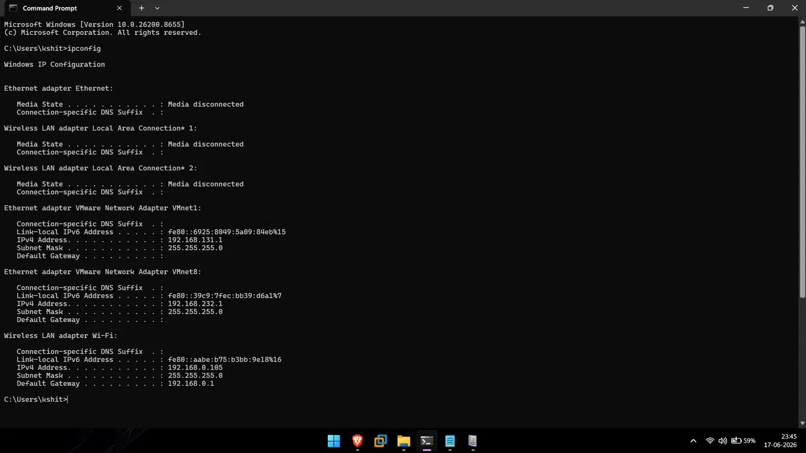 | 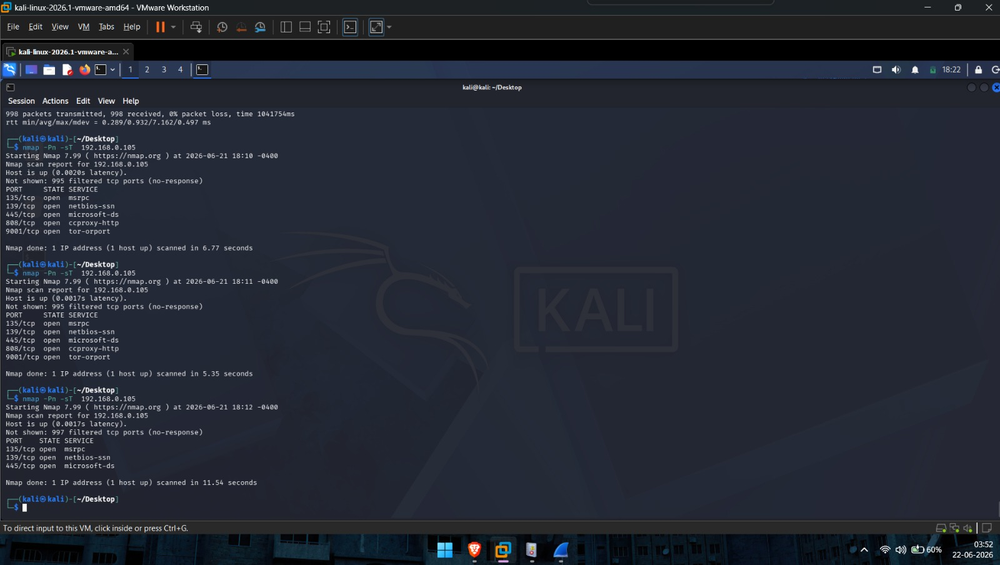 |

### Endpoint & Network Telemetry

| Sysmon — Process Creation (Event ID 1) | Sysmon — Network Connection (Event ID 3) |
|---|---|
| 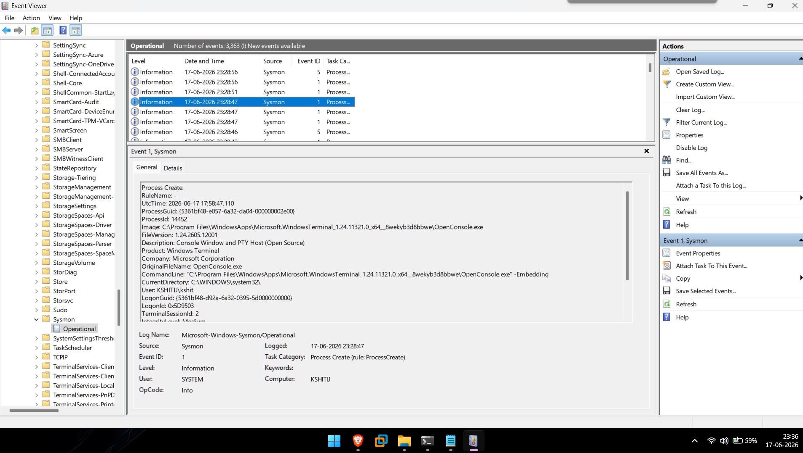 | 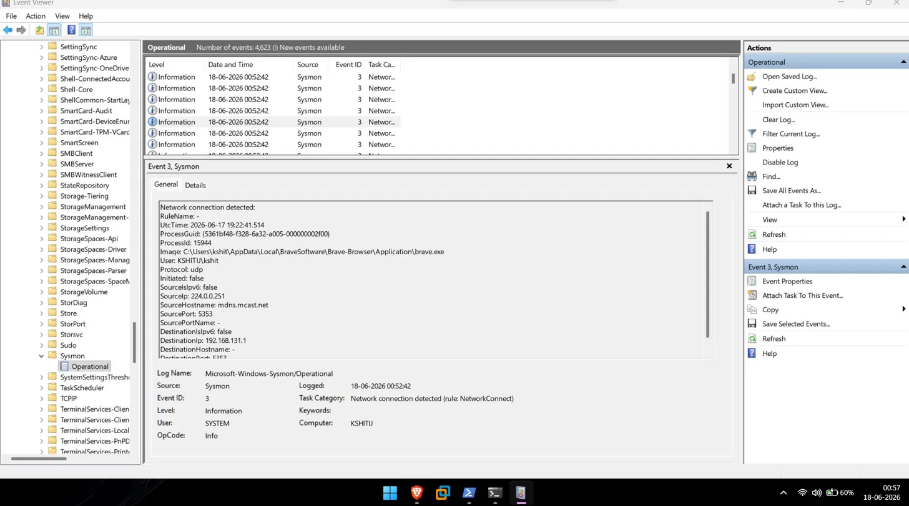 |

| Failed Logon (Event ID 4625) | Successful Logon (Event ID 4624) |
|---|---|
| 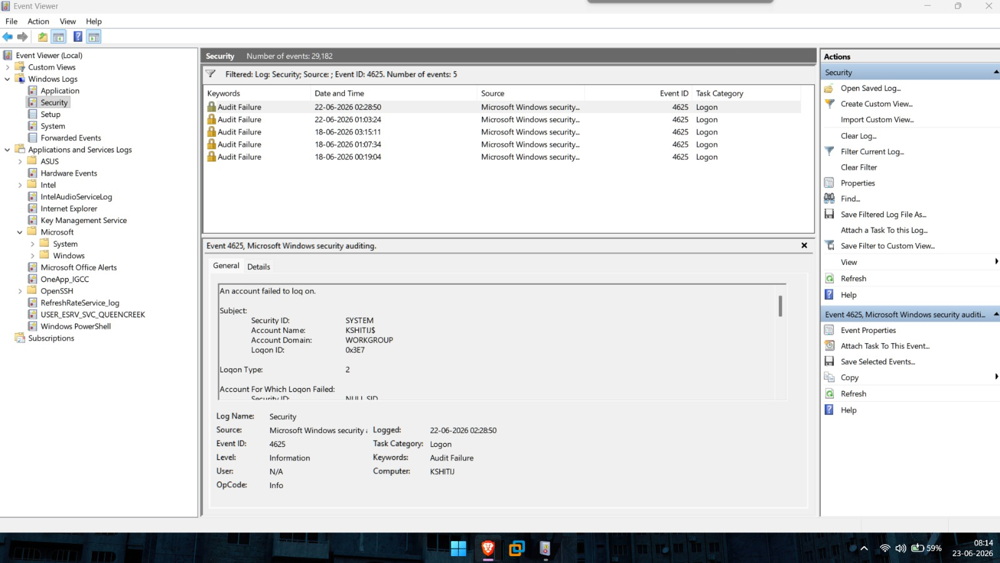 | 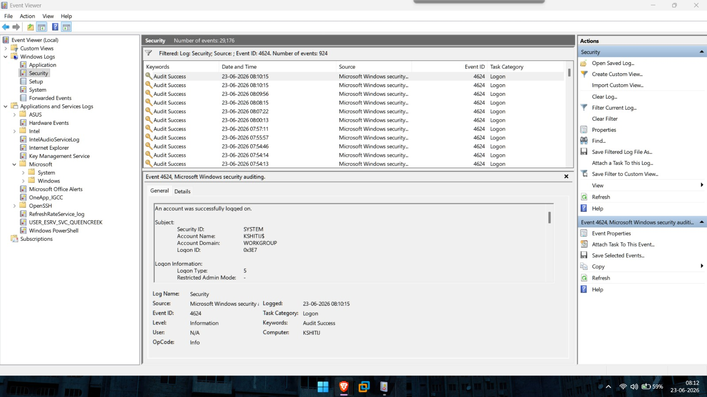 |

| Wireshark TCP Handshake |
|---|
| 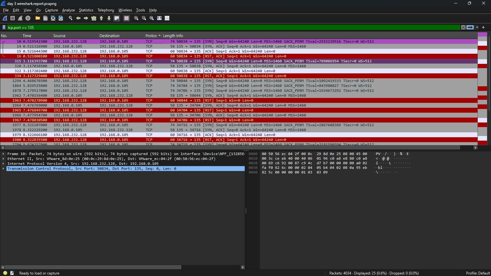 |

### SOC Incident Analyzer (Tool)

| Main Menu | Log Analysis |
|---|---|
| 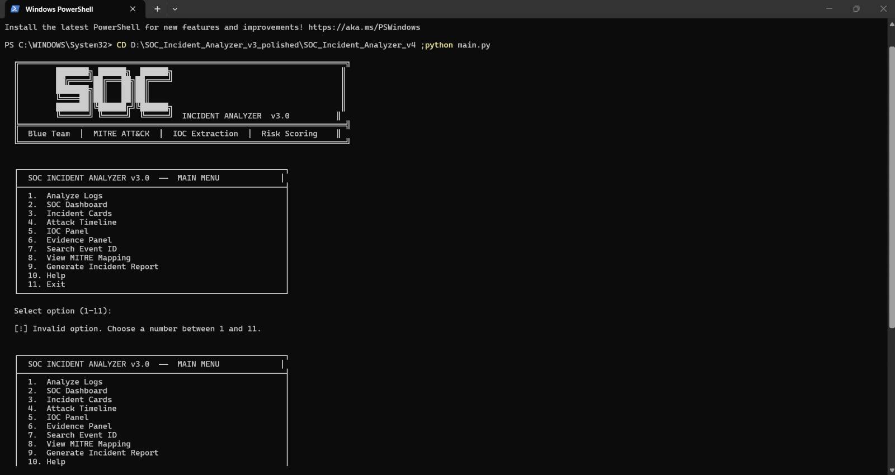 | 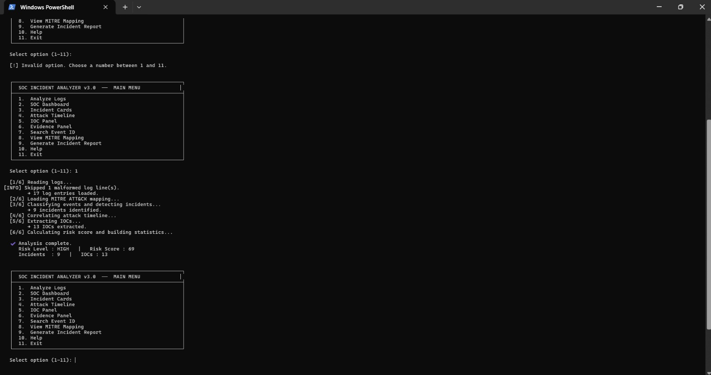 |

| Dashboard | MITRE ATT&CK Mapping |
|---|---|
| 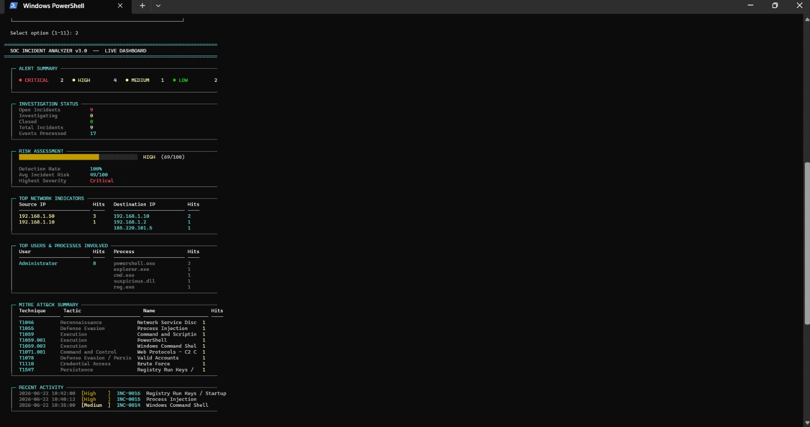 | 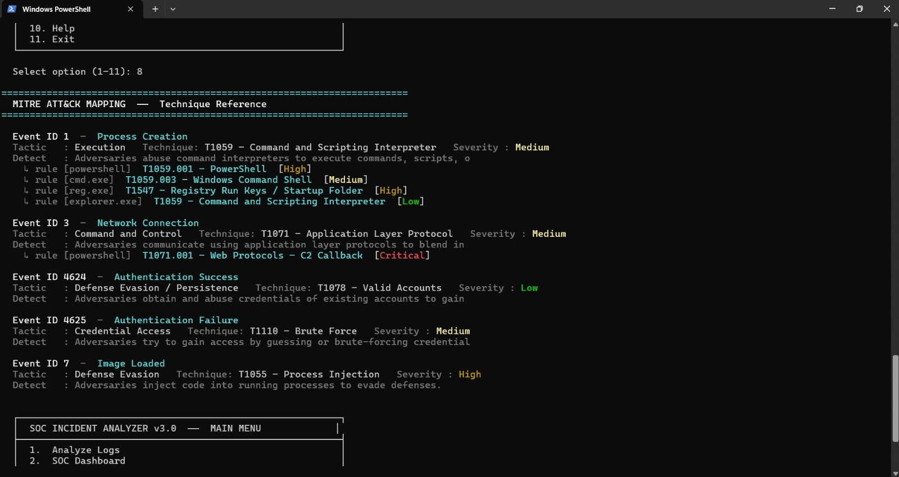 |

### Generated Incident Report

| Executive Summary | Incident Summary |
|---|---|
| 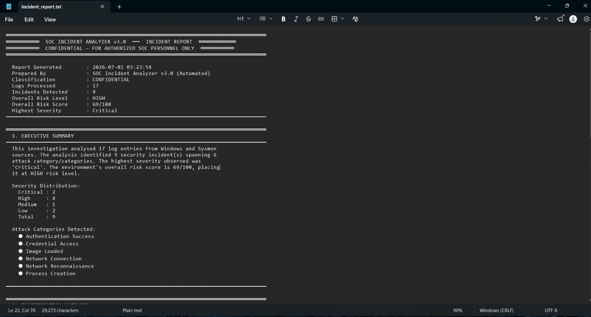 |  |

| Indicators of Compromise | Conclusion |
|---|---|
| 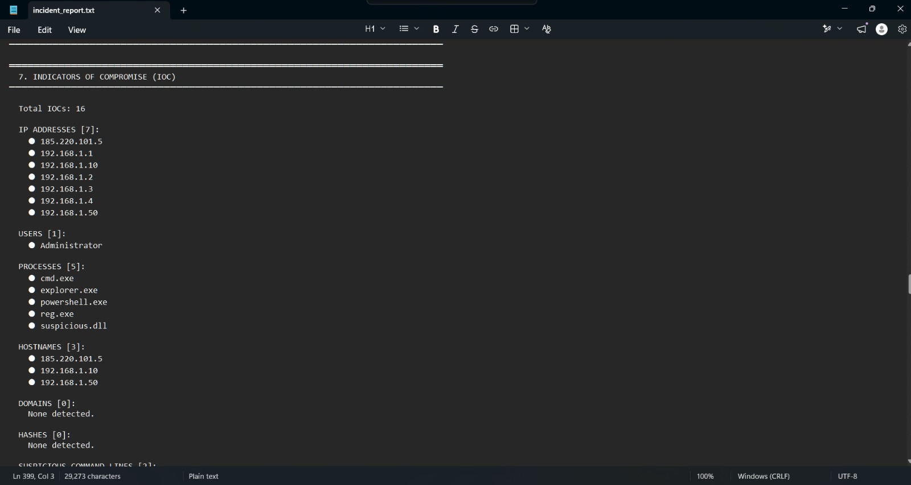 | 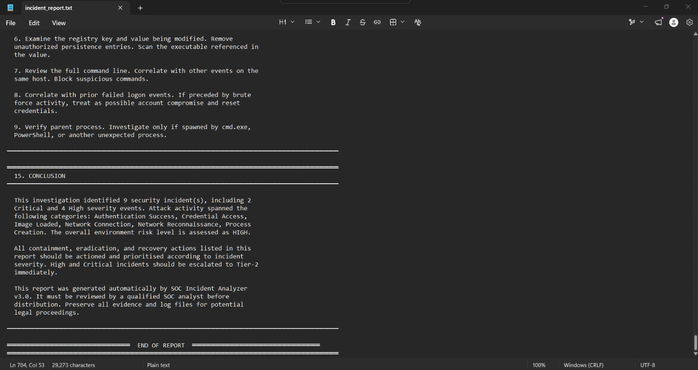 |

---

## ⚙️ How to Run

**1. Clone the repository**
```bash
git clone https://github.com/kshitij333/soc-alert-monitoring-capstone.git
cd soc-alert-monitoring-capstone
```

**2. Install dependencies**
```bash
pip install -r requirements.txt
```

**3. Add your raw log exports**
```bash
# Place exported logs into the /logs directory:
#   - sysmon_logs.evtx / .csv
#   - security_event_logs.evtx / .csv
#   - network_capture.pcap
```

**4. Run the SOC Incident Analyzer**
```bash
python soc_incident_analyzer.py --input ./logs --output ./reports
```

**5. Review the generated report**
```bash
# Output includes:
#   - Correlated incident timeline
#   - Extracted IOCs
#   - MITRE ATT&CK mapping
#   - Final risk score
cat reports/incident_report.md
```

---

## 🎓 Skills Demonstrated

- SOC Tier 1/2 investigation and triage workflow
- Endpoint monitoring and analysis using Sysmon
- Windows authentication log review
- Network traffic analysis and packet inspection
- Controlled attack simulation and log-based detection
- Multi-source log correlation and timeline reconstruction
- IOC identification and documentation
- MITRE ATT&CK framework application
- Risk-based incident prioritization
- Security automation using Python
- Technical incident report writing

---

## 🚀 Future Improvements

- SIEM integration (Splunk / Microsoft Sentinel) for centralized log management
- Real-time log ingestion instead of static/batch log analysis
- Sigma rule development for standardized detection logic
- YARA rule integration for file-based indicator matching
- Expanded log sources (firewall, proxy)
- Dashboard visualization for incident and risk trends

---

## 👤 Author

**Kshitij Rajesh Randhire**
Cybersecurity | SOC Analysis & Detection Engineering

📧 [kshitij.randhire@gmail.com](mailto:kshitij.randhire@gmail.com)
💻 [GitHub — kshitij333](https://github.com/kshitij333)

---

⭐ If you found this project useful, consider giving it a star.
